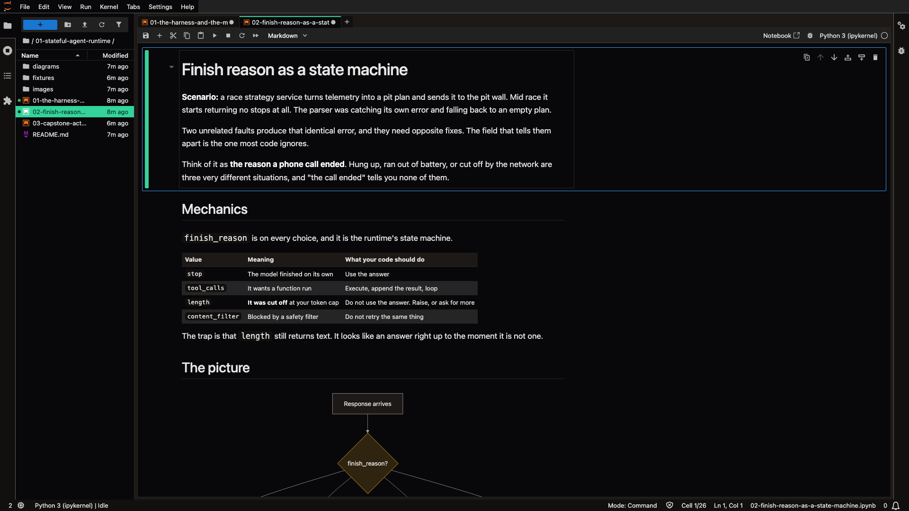

# The recording theme, verified

`check-theme` is structural. It confirms the files exist, parse and agree on fonts. It cannot prove
a render, and does not claim to. This is the proof.

Captured at 1920x1080 from `make run`, driving a headless browser against the repo's own JupyterLab.
Measured from the live DOM at the same time:

| Property | Value |
|---|---|
| Theme | JupyterLab Dark |
| Code font | JetBrains Mono, falling back to SF Mono and Menlo |
| Code size | 16px |

Notification popups are disabled in the repo's settings, because Jupyter's news prompt would
otherwise appear in the corner of a recording.

Refresh this after any change to `.jupyter/custom/custom.css`.
